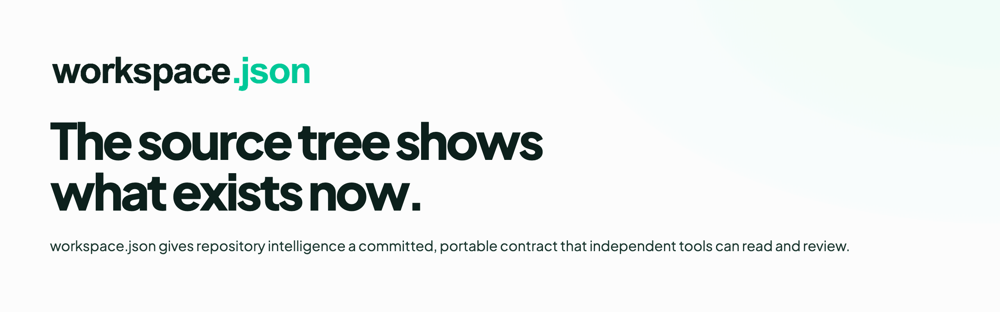
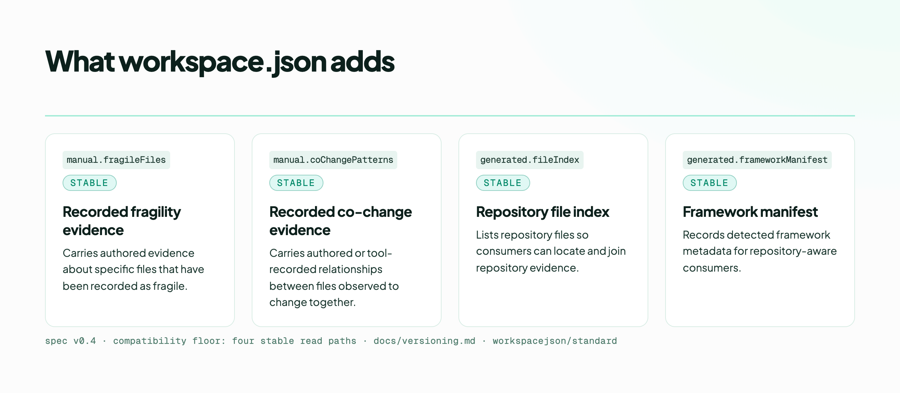
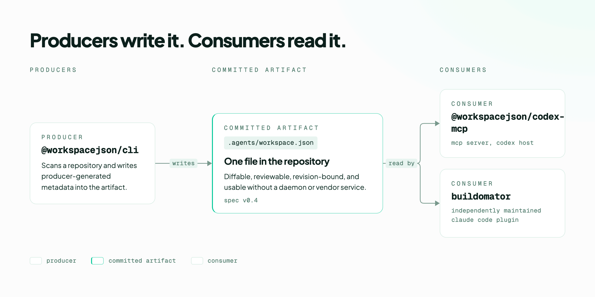

<p align="center">
  <a href="https://github.com/workspacejson/standard">
    <picture>
      <source media="(prefers-color-scheme: dark)" srcset="./assets/readme-hero-dark.png">
      
    </picture>
  </a>
</p>

**workspace.json is an Apache-2.0 open standard for committed, descriptive
repository intelligence at `.agents/workspace.json`, combining
producer-generated metadata with human- or tool-authored evidence in a portable
artifact.**

This repository is the **canonical source of the specification** and of the
deterministic reference behavior that interprets it.

## Why it exists

The source tree shows what exists now. Some repository relationships only become
visible across history. workspace.json gives repository intelligence a
committed, portable contract that independent tools can read and review.

Two properties are load-bearing, and everything else follows from them.

**The standard is descriptive, never prescriptive.** `workspace.json` reports
what a repository *is*. It does not encode what a team *must do*. Prescriptive
policy — approval gates, merge blocking, enforcement rules — belongs outside
`workspace.json`, and CI rejects such fields in the schema.

> AGENTS.md tells an agent how to work. workspace.json describes evidence about
> the repository it is working in.

**The committed file must remain useful without a daemon.** Because it is
committed, workspace.json is diffable, reviewable, revision-bound, and usable by
independent consumers without requiring a daemon or vendor service. Nothing in
the standard may assume a background process is present.

If you want portable repository intelligence to remain an open, interoperable
standard, [star the repository](https://github.com/workspacejson/standard).

## What workspace.json adds

<p align="center">
  <picture>
    <source media="(prefers-color-scheme: dark)" srcset="./assets/surfaces-dark.png">
    
  </picture>
</p>

| Path | Surface | What it carries |
| -- | -- | -- |
| `manual.fragileFiles` | Recorded fragility evidence | Authored evidence about specific files that have been recorded as fragile |
| `manual.coChangePatterns` | Recorded co-change evidence | Authored or tool-recorded relationships between files observed to change together |
| `generated.fileIndex` | Repository file index | Repository files, so consumers can locate and join repository evidence |
| `generated.frameworkManifest` | Framework manifest | Detected framework metadata for repository-aware consumers |

These are observations, not predictions. Nothing here scores, rates or forecasts
a repository.

## Who writes it and who reads it

<p align="center">
  <picture>
    <source media="(prefers-color-scheme: dark)" srcset="./assets/topology-dark.png">
    
  </picture>
</p>

The artifact is the interoperability center. A producer does not define the
standard, and an integration does not become the standard — both meet at the
committed file.

## A concrete example

A source tree can tell you that two files exist. Repository history can show
that they repeatedly changed together. workspace.json gives consumers a
committed place to carry that observation.

This is a complete document — it validates as it stands, so you can paste it
into a file and run the quickstart below against it. The values come from
[`packages/spec/examples/populated-v0.4.json`](./packages/spec/examples/populated-v0.4.json),
a shipped example CI validates on every run; the per-file index detail and the
health block are trimmed to keep the point visible.

```json
{
  "manual": {
    "fragileFiles": [
      { "path": "apps/api/src/auth.ts", "reason": "high rollback rate, auth logic" }
    ],
    "coChangePatterns": [
      {
        "files": [
          "apps/cli/src/commands/check.ts",
          "apps/cli/src/commands/interactive.ts"
        ],
        "note": "always change together — verified by git history"
      }
    ]
  },
  "generated": {
    "specVersion": "0.4",
    "generatedAt": "2026-06-01T00:00:00Z",
    "basisRevision": "9f2c1d5b8a3e47c06d1b2f8e4a7c9013d5e6f8a2",
    "by": { "name": "vrekod", "version": "3.0.0" },
    "frameworkManifest": [{ "name": "turborepo", "confidence": 0.95 }],
    "fileIndex": { "apps/api/src/auth.ts": {} }
  },
  "agents": {},
  "health": {}
}
```

The `manual` block is authored by humans or by tools acting on their behalf. The
`generated` block is producer-written and records both the revision it was
computed from and who computed it, so a reader can tell how current it is and
what produced it. `manual`, `generated`, `agents` and `health` are all required,
which is why the last two appear here empty rather than omitted. Everything
travels with the repository.

## Quickstart

Validate a `workspace.json` document without cloning anything:

```bash
npm install @workspacejson/spec
npx workspacejson-spec validate .agents/workspace.json
```

The command exits `0` on a valid document and non-zero otherwise. `validate
<file>` is its only command — there is no `--help` flag.

To use the schema and types directly:

```ts
import { validate, validateV4 } from '@workspacejson/spec';
import schema from '@workspacejson/spec/schema' with { type: 'json' };

validate(doc);    // true for a valid v0.3 or v0.4 document
validateV4(doc);  // true for a valid v0.4 document
```

This repository defines the format; it does not generate the artifact. Producing
`.agents/workspace.json` belongs to `workspacejson/cli`.

## The compatibility floor

Four paths are externally consumed and are treated as a compatibility surface.
They must remain present and correctly shaped:

```text
manual.fragileFiles
manual.coChangePatterns
generated.fileIndex
generated.frameworkManifest
```

`scripts/check-architecture.mjs` and `scripts/verify-schema-provenance.mjs` both
fail if any of the four is removed or renamed.

### The canonical schema

The normative schema lives at exactly one path in this repository:

```text
packages/spec/schema/v1.json
```

It is shipped inside the `@workspacejson/spec` tarball and resolvable as
`@workspacejson/spec/schema`. Downstream repositories — including the website —
must **materialize** it from a pinned package source and hash-check it, never
maintain an editable second copy. `pnpm run check:schema` prints the canonical
path, byte length and SHA-256 for pinning.

## Status

**The format is at v0.4 and the packages are at `0.4.4`. It is usable and
published, and it is pre-1.0.** Four read paths are treated as a hard
compatibility floor and will not be removed or renamed without a recorded
decision. Everything outside that floor may still change.

There is no external conformance suite yet, and the known gaps are listed
plainly in [`docs/conformance.md`](./docs/conformance.md). No adoption,
endorsement or standards-body status is claimed.

## Packages

| Package | Version | Description |
| -- | -- | -- |
| [`@workspacejson/spec`](./packages/spec) | `0.4.4` | JSON Schema, TypeScript types, validation API, and the `workspacejson-spec` binary |
| [`@workspacejson/rules`](./packages/rules) | `0.4.4` | AGENTS.md parser, repository scanner, workspace.json validator integration, and the deterministic rule engine |

Published versions are **registry-defined**. The versions above describe the
current release family; the registry remains the source of truth:

```bash
npm view @workspacejson/spec version
npm view @workspacejson/rules version
```

Both packages are released as a fixed group, so they always carry the same
version number.

### Package version and spec version are different numbers

Confusing them produces real bugs, so the distinction is worth stating before
you install anything.

`@workspacejson/spec@0.4.4` identifies a release of **this tooling**. A
document's `generated.specVersion` identifies the profile of the format **that
document** conforms to. Neither implies the other: an artifact written by an
older producer keeps its own `specVersion` no matter which package version reads
it, and upgrading the package does not migrate a document.

Each producer declares the specification versions it supports. Producer and
algorithm identity live in the artifact's own basis metadata, not in the package
number. See [`docs/versioning.md`](./docs/versioning.md) for the full profile
table and the compatibility floor.

## The four repositories

This is one of four, with one-way ownership:

| Repository | Owns |
| -- | -- |
| **`workspacejson/standard`** *(this repo)* | specification, JSON Schema, standard types, validation semantics, deterministic rules, compatibility profiles, conformance fixtures, ADRs and governance |
| `workspacejson/cli` | production and generation — the producer, repository scanning, deterministic reconciliation, CLI distribution |
| `workspacejson/integrations` | host adapters — MCP, Codex, VS Code, skills and plugins |
| `workspacejson/workspacejson.dev` | assembled, published documentation at `workspacejson.dev` |

Dependency direction is one-way:

```text
workspacejson/standard
        ↓
workspacejson/cli       workspacejson/integrations
        \                    /
   workspacejson/workspacejson.dev
```

**This repository depends on none of the other three.** That is enforced
mechanically by `scripts/check-architecture.mjs` in CI, with deliberate
violations tested in `scripts/check-architecture.test.mjs`.

## Development

```bash
pnpm install
pnpm -r typecheck
pnpm -r build
pnpm -r test

pnpm run check:architecture        # dependency direction + clean-room guards
pnpm run check:architecture:test   # deliberate violations must be rejected
pnpm run check:schema              # canonical schema provenance
pnpm run check:examples            # every shipped example must validate
pnpm run check:docs                # links, documented commands, public prose
pnpm run release:verify-packs      # packed tarball gates
```

Build before typecheck. `@workspacejson/rules` typechecks against
`@workspacejson/spec`'s **emitted declarations**, which `tsc --noEmit` never
produces — CI uses the same order deliberately. See
[`docs/troubleshooting.md`](./docs/troubleshooting.md).

`@workspacejson/rules` depends on `@workspacejson/spec` via `workspace:*`. That
is correct here: both packages live in **this one** pnpm workspace, and `pnpm
pack` rewrites the protocol to the exact version before publication. It is an
intra-repository link, not a cross-repository one. `scripts/verify-package-tarball.mjs`
proves no `workspace:` protocol ever reaches a packed manifest.

## Publication authority

**No package publication authority has transferred to this repository yet.**

`@workspacejson/spec` and `@workspacejson/rules` are still published from
`workspace-json/agents-audit`, which holds the credential. This repository has
no npm secret and **no release workflow at all** — see
[`.github/RELEASE-AUTHORITY.md`](./.github/RELEASE-AUTHORITY.md). Transferring
authority is a separate coordinated change that must revoke the old authority in
the same act.

## Provenance

This repository was extracted from `workspace-json/agents-audit` at frozen
source SHA `e47eb1b8556c4f361db9a78190a2f36b400756e8`, preserving history for
standard-owned paths. See [`migration/PROVENANCE.md`](./migration/PROVENANCE.md)
for the exact command, included and excluded paths, tree hashes, commit map and
rollback reference.

The campaign assets above are vendored in [`assets/`](./assets), with their
production record — export sizes, alt text and recorded deviations — in
[`assets/PRODUCTION-RECEIPT.md`](./assets/PRODUCTION-RECEIPT.md).

## Documentation

| Document | What it answers |
| -- | -- |
| [Versioning and compatibility](./docs/versioning.md) | What may I rely on, and what may change? |
| [Conformance](./docs/conformance.md) | How do I check an implementation — and what is not yet covered? |
| [Troubleshooting](./docs/troubleshooting.md) | Why did that fail, and is it deliberate? |
| [Glossary](./docs/glossary.md) | What does this term mean here? |
| [Architecture decision records](./docs/adr/) | Why is it this way, and who decided? |
| [Repository settings](./docs/repository-settings.md) | What configuration is intended, and what is actually set? |

## Project

| | |
| -- | -- |
| [`CONTRIBUTING.md`](./CONTRIBUTING.md) | How to propose and land a change |
| [`GOVERNANCE.md`](./GOVERNANCE.md) | How decisions are made and what needs an ADR |
| [`MAINTAINERS.md`](./MAINTAINERS.md) | Who reviews and merges |
| [`OWNERSHIP.md`](./OWNERSHIP.md) | What this repository owns and must never define |
| [`SUPPORT.md`](./SUPPORT.md) | Where to ask, and what response to expect |
| [`SECURITY.md`](./SECURITY.md) | How to report a vulnerability privately |
| [`CODE_OF_CONDUCT.md`](./CODE_OF_CONDUCT.md) | Expected conduct |

## Known limitations

Stated here rather than discovered later:

- **No external conformance suite.** An independent implementation cannot yet run
  a standard battery to claim conformance. See
  [`docs/conformance.md`](./docs/conformance.md) for the full gap list, including
  the absence of negative examples and of a shipped legacy-profile fixture.
- **This repository cannot publish.** Both packages are released from the
  historical repository, which holds the only credential. That is deliberate and
  enforced in CI.
- **The schema `$id` is reconciled on `main` but not in the released bytes.**
  `main` declares the bare domain, matching the package manifests. The published
  `@workspacejson/spec@0.4.4` still serves the `www.` host, because the fix
  changes schema bytes and has not been released. Both hosts serve the schema,
  so nothing is broken — but do not read `main` as released truth here.
- **`v1.json` is a legacy filename**, not a claim that the format is at 1.0.
- **Four ambient interop shims are retained** in `types/ambient.d.ts` for
  `simple-git`, `remark` and `ajv`. They are real CJS/ESM mismatches in
  third-party packages, tracked as their own work rather than papered over.
- **`main` has no enforceable independent-review path.** Branch protection is
  enabled — required checks on Node 20/22 plus four-path producer conformance,
  dismissed stale approvals, code-owner review, conversation resolution, and no
  force-push or deletion. But the general `required_approving_review_count` is
  `0`; code-owner review is enabled and does block affected pull requests, yet
  every path in [`.github/CODEOWNERS`](./.github/CODEOWNERS) is owned solely by
  `@qmarcelle`, who authors the changes — and an author cannot approve their own
  pull request. Administrator enforcement is also off, so the administrator can
  bypass the protection entirely. The controls exist; no combination of them
  currently produces review by a second person. Recorded, with the remediation
  it actually requires, in
  [`docs/repository-settings.md`](./docs/repository-settings.md).

## License

[Apache-2.0](./LICENSE). Copyright the workspacejson contributors.
